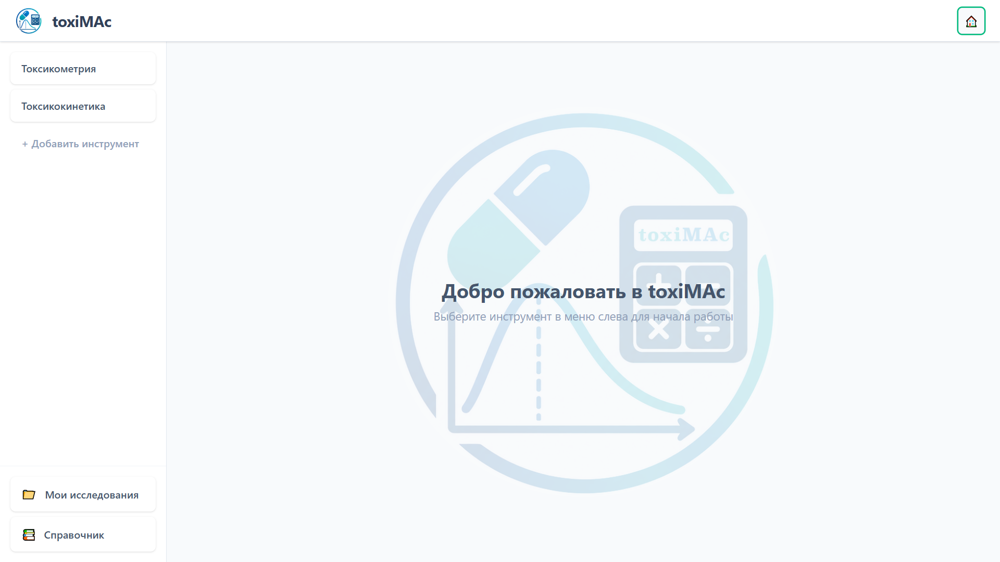
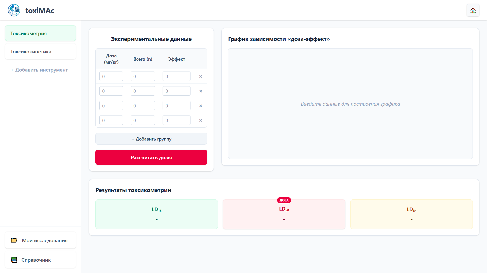
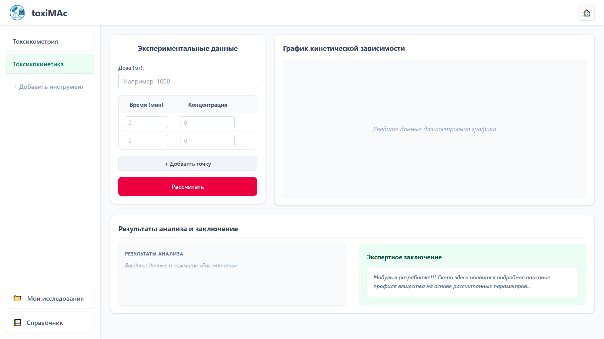
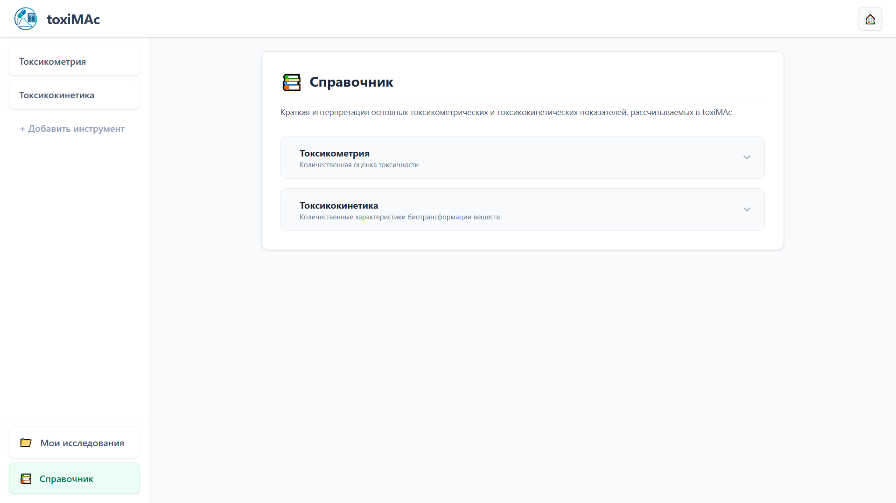

# toxiMAc

Приложение для расчёта фармакокинетических и токсикометрических показателей.

## О проекте

**toxiMAc** — это веб-приложение для расчёта и интерпретации фармакокинетических параметров и токсикометрических показателей. Разработано для специалистов в области фармакологии, токсикологии и доклинических исследований.

### Основные возможности

- **Токсикометрия** — расчёт доз методом пробит-анализа
- **Токсикокинетика** — расчёт AUC, Cmax, Tmax, t½, Vd, CL, MRT, Vss методом NCA
- **Интерактивные графики** — кривая «доза–эффект» и «концентрация–время»
- **Сохранение исследований** — база данных H2, поиск, пагинация
- **Мои исследования** — просмотр, детали, удаление
- **Справочник** — научная интерпретация параметров
- **Экспорт** — графики в PNG

## Технологии

### Backend
- **Java 17**
- **Spring Boot 3.3.5**
- **Spring Data JPA** + **Hibernate**
- **H2 Database**
- **Lombok**
- **Maven**

### Frontend
- **React 18**
- **Vite** 
- **Tailwind CSS** 
- **Recharts**
- **React Router**

## Структура проекта
Проект разделён на две части: **backend** (Spring Boot) и **frontend** (React + Vite).

**Backend** (`backend/src/main/java/ru/mas/toximas/`):

- `controller/calculation/` — NCA + LD расчёты
- `controller/toxicokinetic/` — CRUD токсикокинетики
- `controller/toxicometry/` — CRUD токсикометрии
- `dto/core/`, `dto/toxicokinetic/`, `dto/toxicometry/` — DTO по папкам
- `entity/` — JPA-сущности
- `repository/` — Spring Data репозитории
- `service/calculation/`, `service/toxicokinetic/`, `service/toxicometry/` — бизнес-логика

**Frontend** (`frontend/src/`):

- `api/` — fetch-обёртки для запросов к бэкенду
- `components/experiments/` — модалка + карточки исследований
- `components/layout/` — Header, Sidebar
- `components/shared/` — ParameterCard, AI-панель
- `components/toxicokinetics/`, `components/toxicometry/` — компоненты страниц
- `constants/` — API URL, цвета, пути
- `pages/` — страницы приложения
- `utils/` — форматтеры, расчёты
- `App.jsx` — корневой компонент

## Быстрый старт

### Требования

- **Java 17+** (JDK)
- **Node.js 18+** + **npm**
- **Maven** (или `./mvnw` в комплекте)

### 1. Клонирование репозитория
```bash
git clone https://github.com/AlekSMakacheev/toxiMAc.git
cd toxiMAc
```

### 2. Запуск Backend
```bash
cd backend
./mvnw spring-boot:run
```
### 3. Запуск Frontend

```bash
cd frontend
npm install
npm run dev
```

## Скриншоты





## Автор
**AlekSMakacheev**
- GitHub: [@AlekSMakacheev](https://github.com/AlekSMakacheev)